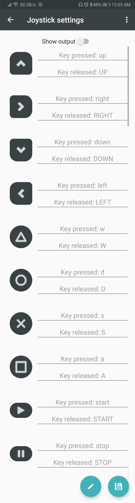

# BlueDino
Easily integrate bluetooth into your projects with BlueDino App.
## Build in modes
- [Terminal](#terminal)
- [Digital switch](#digital-switch)
- [Analog sliders](#analog-sliders)
- [Joystick](#joystick)
## Default settings
|Mode|Settings|
|:-|:-|
|Terminal|username: `BlueDino`|
|Digital switch|on-message: `ON`, off-message: `OFF`|
|Analog sliders|range: `0-255`|
|Joystick|[values](#key-values): `key-pressed`, `key-realeased` |
### Terminal
Send and receive messages using this simple terminal.
### Digital switch
Send customlizable on and off messages.
### Analog sliders
Send a range of values using sliders.
### Joystick
Use this simple joystick to control your projects.
#### Key values

## Getting started
To get started, flash an [example sketch](#examples-using-arduino) and connect your blurtooth module, once this is done you should be able to interact with your bluetooth module using BlueDino.
1. Open the app and grand bluetooth permission
2. Press the find icon to search for your device
3. Select your device
4. Select a any mode and start sending messages

You should be able to see the messages in the Arduino IDE serial monitor.
## Global settings
This are the global settings that make BlueDino App highly customizable.
## Examples using Arduino IDE
### Send data
### Send and receive data
